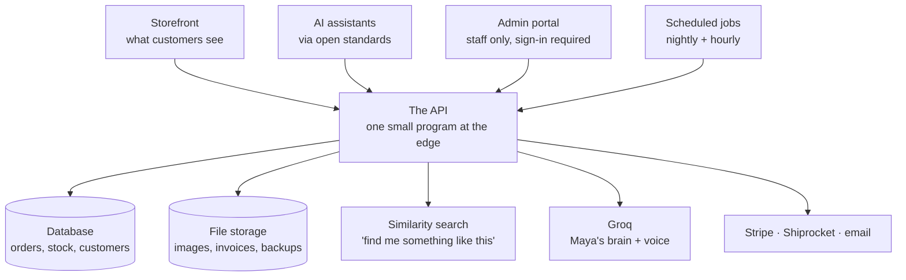

# ☕ The Daily Roast

**An online shop for a small-batch coffee roaster — with a staff back office and an AI barista named Maya — that runs almost entirely on free hosting.**

[](https://developers.cloudflare.com/workers/)
[](https://hono.dev/)
[](https://groq.com/)
[](https://modelcontextprotocol.io/)

**Live:** [dailyroast.in](https://dailyroast.in) · [admin.dailyroast.in](https://admin.dailyroast.in) (staff only) · [api.dailyroast.in](https://api.dailyroast.in)

---

## The idea

Most coffee roasters are tiny businesses. They can't afford a big engineering team or a five-figure monthly hosting bill, but they still want a real shop: a proper product catalogue, a subscription option, loyalty points, tour bookings, and someone to answer *"which of these tastes like the one I had last time?"* at 11pm.

The Daily Roast is that shop, built three ways:

| For whom | What it is | Where |
| --- | --- | --- |
| **Customers** | The storefront — browse coffees, build a box, subscribe, book a cupping, chat with Maya | [dailyroast.in](https://dailyroast.in) |
| **Staff** | A back office — orders, stock, pricing, sourcing leads, KPIs | [admin.dailyroast.in](https://admin.dailyroast.in) |
| **AI assistants** | A machine-readable version of the whole catalogue and cart, so an agent can shop on a customer's behalf | [api.dailyroast.in](https://api.dailyroast.in) |

Two principles run through every decision:

1. **It should cost almost nothing to run.** Everything is sized to fit inside the free tiers of the services it uses.
2. **It should work for robots too.** The catalogue and cart aren't just a website — they're offered to AI agents through open standards (MCP, OpenAPI), so the shop is as usable by an assistant as by a person.

---

## What customers can do

- **Shop the coffees** — each with tasting notes, roast meters (acidity, body, sweetness), and a choice of grind and bag size.
- **Build and check out a cart** — with coupon codes and card payment.
- **Subscribe** — pick a plan and cadence, then pause, skip a delivery, or swap the coffee whenever they like.
- **Earn and spend loyalty points** — points build up on delivered orders and reviews, and come off the next bill.
- **Refer a friend** — share a code; both sides get a reward once the friend's first order arrives.
- **Book an experience** — a cupping session or a roastery tour, with real seat limits.
- **Get told when it matters** — a browser notification when a sold-out coffee is back, or an hour before a booking.
- **Talk to Maya** — the AI barista. Ask for a recommendation, check an order, or add something to the cart by chatting. You can type or press-to-talk, and she can read her answers back. Maya always asks before changing your cart, and she won't invent an order status or a price she doesn't actually know.

## What staff can do

- See live sales, stock, and fulfilment status at a glance.
- Restock in one click, and move orders through *roasting → packed → shipped*.
- Manage pricing, coupons, loyalty rules, and subscriptions.
- Track green-coffee sourcing leads against a harvest-season calendar.
- Ask Maya the same kinds of questions, scoped to staff tasks.

---

## How it's built



Everything hangs off one small program (the API) that runs on **Cloudflare's edge network** — close to the user, and free up to a generous limit. It stores data in Cloudflare's database, keeps images and nightly backups in Cloudflare's file storage, and calls out to a few specialists: **Groq** for Maya's reasoning and speech-to-text, **Stripe** for payments, **Shiprocket** for Indian shipping, and **Resend** for email.

Scheduled jobs run on their own: a nightly pass backs up the database and raises low-stock alarms; an hourly pass tidies up bookings and subscription billing.

### The pieces

| Folder | What lives there |
| --- | --- |
| [`apps/storefront`](apps/storefront) | The customer website |
| [`apps/admin`](apps/admin) | The staff back office |
| [`apps/api`](apps/api) | The one small program everything talks to |
| [`packages/db`](packages/db) | The database shape — 30 versioned migrations |
| [`packages/shared-types`](packages/shared-types) | Definitions shared by all of the above, including the tools offered to AI agents |
| [`docs`](docs) | The build roadmap and go-live notes |

---

## For AI agents

The shop publishes itself in formats an assistant can read directly:

| Address | What it offers |
| --- | --- |
| `POST /api/mcp` | A tool server (Model Context Protocol) for browsing, cart, and orders |
| `GET /.well-known/mcp.json` | Where to find that tool server |
| `GET /api/agent/openapi.json` | The same tools described as an OpenAPI spec |
| `GET /api/agent/card` | A short "who am I and what can I do" card |
| `POST /api/agent/chat` | Chat with Maya (streamed or all at once) |

There's also a set of plain-text discovery files (`llms.txt`, `llms-full.txt`, an FAQ feed) generated at build time, plus a real web page for every single coffee and brew method — so a search engine or an assistant answering *"where do I buy Attikan Estate honey process?"* has an actual page to point at, not just the homepage.

---

## Running it yourself

You'll need **Node.js 20+**.

```bash
git clone <repo-url>
cd coffee-roast
npm install
npm run build
npm test
```

Then start the three parts, each in its own terminal:

```bash
npm run dev:api         # the API            → http://localhost:8787
npm run dev:storefront  # the shop           → http://localhost:5173
npm run dev:admin       # the back office    → http://localhost:5174
```

The shop and back office automatically talk to your local API, not the live one.

**Keys and secrets** are never committed. The system is built to degrade politely when one is missing — no payment key means checkout is disabled, no email key means confirmation emails are logged instead of sent, and so on. The full annotated list is in [`apps/api/wrangler.toml`](apps/api/wrangler.toml).

---

## Honest about what's not done

This project keeps its README truthful about the gaps:

- **Bot protection is switched off in production.** The check is wired up but inactive until a key is set, so for now the AI endpoints are guarded by rate limits and a spending cap alone.
- **Back-in-stock browser notifications are built but dormant** — the signing keys aren't set in production yet.
- **Prices are still labelled in US dollars** on an India-only shop. That's a known bug in the data model, not a choice — see [`docs/roadmap-gaps.md`](docs/roadmap-gaps.md).
- **The background job queue isn't deployed** — that work currently runs inline.

The complete backlog, with pointers into the code, is in [`docs/roadmap-gaps.md`](docs/roadmap-gaps.md). Shipping go-live notes are in [`docs/shiprocket-golive.md`](docs/shiprocket-golive.md).

---

## What it costs to run

| Service | Free allowance | Used for |
| --- | --- | --- |
| Cloudflare Workers | 100,000 requests/day | Running the API |
| Cloudflare D1 | millions of reads/day | Orders, stock, customers |
| Cloudflare R2 | 10 GB | Images, invoices, backups |
| Cloudflare Workers AI | 10,000 units/day | "Find me something similar" search |
| Cloudflare Access | 50 seats | Staff sign-in |
| Scheduled jobs | unlimited | Nightly backups, hourly upkeep |

Groq, Stripe, Shiprocket, and email are paid separately and only when used.

---

## License

There's no license file yet — the terms are undecided, so please treat the code as **all rights reserved** for now.

© 2026 The Daily Roast Roasting Co.
